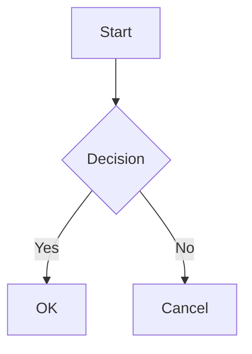

# Obsidian Feature Specification

Comprehensive catalog of Obsidian (obsidian.md) features, UX patterns, and technical details.
Intended as a reference for building a native Qt6/C++ clone (Corbomite).

---

## Table of Contents

1. [Core Features](#1-core-features)
2. [UX Patterns & UI Layout](#2-ux-patterns--ui-layout)
3. [Keyboard Shortcuts](#3-keyboard-shortcuts)
4. [Canvas View](#4-canvas-view)
5. [Markdown Format (Obsidian-Flavored)](#5-markdown-format-obsidian-flavored)
6. [Vault System](#6-vault-system)
7. [Graph View](#7-graph-view)
8. [File Organization](#8-file-organization)
9. [Search](#9-search)
10. [Properties / Metadata](#10-properties--metadata)

---

## 1. Core Features

### 1.1 Editor

Obsidian's editor is built on CodeMirror 6. It supports three distinct modes:

#### 1.1.1 Live Preview Mode (Default)
- WYSIWYG-like editing where markdown syntax is rendered inline as you type
- Clicking on rendered elements (bold, links, headings) reveals the underlying markdown at the cursor position
- Images, embeds, and LaTeX render inline but become editable when cursor is placed on them
- Code blocks render with syntax highlighting
- Checkboxes are clickable
- Tables render as formatted tables but can be edited by clicking into cells
- Links render as clickable text; clicking follows the link, placing cursor on them reveals `[[]]` syntax
- Callouts render with icons and colored backgrounds
- The cursor line always shows raw markdown; surrounding lines show rendered output
- Frontmatter/properties are displayed as a structured property editor widget (not raw YAML) at the top of the note

#### 1.1.2 Source Mode
- Plain text editing showing all raw markdown syntax
- No inline rendering of any elements
- Syntax highlighting for markdown elements (headings colored, bold/italic styled, code in monospace, etc.)
- All `[[wikilinks]]`, `**bold**`, `# headings` etc. shown as raw text
- Frontmatter shown as raw YAML between `---` delimiters
- Behaves like a traditional code/text editor

#### 1.1.3 Reading Mode (formerly "Preview Mode")
- Fully rendered, non-editable view of the note
- All markdown rendered to final form
- Images displayed at full size
- Embeds (![[note]]) rendered inline showing the content of the referenced note
- Interactive elements: checkboxes can be toggled, links can be clicked
- Code blocks have a copy button
- Tables are fully formatted
- Math/LaTeX rendered via MathJax
- Mermaid diagrams rendered as SVG
- Toggle between reading mode and editing mode via button in top-right or Ctrl+E

#### 1.1.4 Editor Features
- **Line numbers**: Optional, toggleable in settings
- **Fold headings**: Click arrow next to headings to collapse/expand sections
- **Fold indent**: Collapse indented content
- **Vim mode**: Full vim keybindings support (toggled in settings)
- **Spell check**: Native OS spellcheck integration
- **Auto-pair brackets**: `()`, `[]`, `{}`, `""`, `''`, ``` `` ```
- **Auto-pair markdown**: `**`, `__`, `~~`, `` ` ``, `$$`
- **Smart indent**: Continues list indentation
- **Tab indent size**: Configurable (default 4)
- **Use tabs or spaces**: Configurable
- **Line wrap**: On by default, can be turned off for horizontal scrolling
- **Strict line breaks**: Toggle whether single newlines create line breaks
- **Readable line length**: Constrains text width to ~700px for readability (toggleable)
- **Show frontmatter**: Toggle whether raw YAML is shown vs. property editor
- **Default editing mode**: Configurable per-vault (Live Preview or Source)

### 1.2 Graph View

See [Section 7](#7-graph-view) for full details.

- Global graph showing all notes and their connections
- Local graph showing connections for the current note
- Interactive force-directed layout
- Filtering by tags, paths, search terms
- Color groups based on queries

### 1.3 Canvas View

See [Section 4](#4-canvas-view) for full details.

- Infinite whiteboard for visual note arrangement
- Cards (text cards, note cards, media cards, web cards)
- Connections between cards with labels
- Groups for organizing cards
- `.canvas` JSON file format

### 1.4 Backlinks

- **Backlinks pane**: Shows all notes that link to the current note
- Displayed in right sidebar by default
- Each backlink shows the surrounding context (the paragraph containing the link)
- Grouped by source file
- **Linked mentions**: Notes that explicitly link via `[[current note]]`
- **Unlinked mentions**: Notes that contain the text of the current note's name but don't use a wikilink -- these can be "linked" with a click
- Count badge shows number of backlinks
- Can be shown at the bottom of the note (in-document backlinks) or in a separate pane

### 1.5 Outgoing Links

- Pane showing all links from the current note to other notes
- Distinguishes between existing links (to files that exist) and unresolved links (to files that don't exist yet)
- Clicking a link navigates to that note
- Clicking an unresolved link creates the note

### 1.6 Tags

- Inline tags: `#tag` anywhere in note body
- Nested tags: `#parent/child/grandchild` using `/` separator
- Tags in frontmatter: `tags: [tag1, tag2]` or YAML list format
- Tag pane: Shows all tags in the vault with counts, organized hierarchically
- Clicking a tag in the tag pane opens a search for all notes with that tag
- Tags are case-insensitive for matching but preserve original case
- Tag auto-completion when typing `#`
- Tags can contain letters, numbers, underscores, hyphens, and forward slashes
- Tags cannot start with a number
- Tags cannot contain spaces (space terminates the tag)

### 1.7 Templates (Core Plugin)

- Designated templates folder (configurable)
- Insert template: Command palette or hotkey inserts template content at cursor
- Template variables:
  - `{{title}}` - name of the current note
  - `{{date}}` - current date (format configurable, e.g., `YYYY-MM-DD`)
  - `{{time}}` - current time (format configurable, e.g., `HH:mm`)
  - `{{date:FORMAT}}` - date with custom Moment.js format string
  - `{{time:FORMAT}}` - time with custom Moment.js format string
- Templates are just regular markdown files in the templates folder
- The "Templater" community plugin is far more powerful (but is third-party)

### 1.8 Daily Notes (Core Plugin)

- Create/open today's daily note with a single command or hotkey
- Configurable date format for filename (e.g., `YYYY-MM-DD`)
- Configurable folder for daily notes
- Configurable template to use when creating a new daily note
- Option to open daily note on startup
- Calendar navigation (with Calendar community plugin)

### 1.9 Search (Core Plugin)

See [Section 9](#9-search) for full syntax details.

- Global search across all notes in vault
- Real-time results with highlighted matches
- Context preview showing surrounding text
- Sort by relevance, filename, modified date, created date
- Collapse/expand results
- Copy search results

### 1.10 Quick Switcher (Core Plugin)

- Opened with `Ctrl+O`
- Fuzzy filename search across all notes in vault
- Shows recent files at top when no query entered
- Creates new note if entered name doesn't match existing file
- Shows folder path for disambiguation
- Keyboard navigation: arrow keys to select, Enter to open
- Supports path-based filtering: type `folder/` to scope to folder
- Alias matching: matches against note aliases defined in frontmatter

### 1.11 Command Palette (Core Plugin)

- Opened with `Ctrl+P`
- Fuzzy search across all available commands
- Shows assigned hotkeys next to commands
- Includes commands from all enabled plugins (core and community)
- Pin frequently used commands to top
- Extensible: plugins register their own commands

### 1.12 Bookmarks (formerly Starred)

- Bookmark notes, folders, searches, headings, blocks, or graph views
- Bookmarks pane in sidebar
- Organize bookmarks into groups
- Reorder bookmarks via drag-and-drop
- Bookmark the current note via command or right-click menu

### 1.13 File Explorer (Core Plugin)

- Left sidebar showing vault folder structure as a tree
- Create new notes or folders via buttons or right-click context menu
- Drag and drop for moving files/folders
- Right-click context menu: rename, delete, move, duplicate, reveal in system explorer
- Sort options: alphabetical, by modified time, by created time
- Collapse/expand folders
- File icons based on file type
- Shows attachment count

### 1.14 Outline View (Core Plugin)

- Right sidebar pane showing heading structure of current note
- Hierarchical tree matching heading levels (H1-H6)
- Click heading in outline to scroll to that section
- Updates in real-time as you edit
- Collapse/expand nested headings

### 1.15 Word Count (Core Plugin)

- Status bar display showing word count and character count for current note
- Updates in real-time as you type

### 1.16 Page Preview (Core Plugin)

- Hover over internal links to see a popup preview of the linked note
- Preview appears after brief delay
- Ctrl+hover for immediate preview
- Preview shows rendered content
- Can scroll within the preview popup

### 1.17 Note Composer (Core Plugin)

- Extract selection to new note: Select text, invoke command, creates new note with selected text and replaces selection with a link
- Merge notes: Combine content of current note with another note

### 1.18 Slides (Core Plugin)

- Present notes as slideshows
- Slides separated by `---` (horizontal rule)
- Uses reveal.js for rendering
- Supports speaker notes, transitions

### 1.19 Audio Recorder (Core Plugin)

- Record audio directly within Obsidian
- Saves as `.webm` file in vault
- Embeds recording in current note

### 1.20 Workspaces (Core Plugin)

- Save and restore workspace layouts (which panes are open, their arrangement)
- Switch between different workspace configurations
- Useful for different workflows (writing, reviewing, researching)

### 1.21 Publish & Sync (Paid Services)

- **Obsidian Publish**: Publish notes as a website
- **Obsidian Sync**: End-to-end encrypted sync between devices
- These are paid services, not relevant for a clone, but noted for completeness

### 1.22 Community Plugins

- Obsidian supports a rich third-party plugin ecosystem
- Plugins are JavaScript/TypeScript loaded from the `.obsidian/plugins/` directory
- Each plugin has: `manifest.json`, `main.js`, optional `styles.css`, optional `data.json` (settings)
- Plugin API provides access to vault, editor, workspace, settings, events
- Over 1,700+ community plugins in the official registry

---

## 2. UX Patterns & UI Layout

### 2.1 Overall Layout

```
+---+--------------------------------------------------+---+
|   |  Tab Bar (horizontal tabs for open notes)         |   |
| L |--------------------------------------------------| R |
| E |                                                  | I |
| F |                                                  | G |
| T |           Main Editor Area                       | H |
|   |          (can be split horizontally              | T |
| S |           or vertically into panes)              |   |
| I |                                                  | S |
| D |                                                  | I |
| E |                                                  | D |
| B |                                                  | E |
| A |                                                  | B |
| R |                                                  | A |
|   |                                                  | R |
+---+--------------------------------------------------+---+
| Ribbon |            Status Bar                            |
+---+------------------------------------------------------+
```

### 2.2 Left Sidebar

- Toggle with button or `Ctrl+/` (on some versions)
- Contains tabs/icons for:
  - **File Explorer**: Vault folder tree
  - **Search**: Global search panel
  - **Bookmarks/Starred**: Bookmarked items
  - **Tag Pane**: Hierarchical tag list (if enabled)
- Width is resizable by dragging the edge
- Can be collapsed to just show icons
- Sidebar tabs switch between views (only one visible at a time)

### 2.3 Right Sidebar

- Toggle with button
- Contains tabs for:
  - **Backlinks**: For current note
  - **Outgoing Links**: For current note
  - **Outline**: Heading structure
  - **Tags**: (can appear here too)
  - **Local Graph**: Small graph for current note
- Same resizing and tab-switching behavior as left sidebar
- Can have multiple tabs stacked vertically (split between upper and lower)

### 2.4 Ribbon (Left-edge Icon Strip)

- Vertical strip of icons on the far left edge (to the left of the left sidebar)
- Contains quick-access buttons:
  - Open Quick Switcher
  - Open Graph View
  - Open Canvas
  - Create New Note
  - Open Today's Daily Note
  - Open Command Palette
  - Open Settings
  - Toggle Left Sidebar
  - Open Help
- Plugins can add their own ribbon icons
- Icons can be reordered
- Can be hidden entirely in settings
- On mobile, this becomes a bottom toolbar

### 2.5 Tab Bar

- Horizontal tab bar at top of editor area (like browser tabs)
- Each open note is a tab
- Tabs show note title (or filename)
- Close button (X) on each tab
- Middle-click to close tab
- Drag tabs to reorder
- Drag tab to create split pane
- Right-click context menu: Close, Close others, Close all, Close to right, Pin tab
- Pinned tabs: smaller, don't have close button, persist across sessions
- Stacked tabs: alternative view where tabs appear as a vertical list
- "New tab" button (+) at end of tab bar
- Active tab is highlighted
- Modified indicator (dot) on unsaved tabs (though Obsidian auto-saves)

### 2.6 Split Panes

- Editor area can be split into multiple panes:
  - **Horizontal split**: Side by side
  - **Vertical split**: Top and bottom
- Split via: drag a tab, right-click tab "Split right/down", or command
- Each pane has its own tab bar
- Panes can be resized by dragging the divider
- Panes can be further split recursively
- Link panes: Ctrl+click on the link icon in a pane header to "link" two panes (scrolling syncs, or navigating in one updates the other)
- Maximum nesting is practical, not technically limited

### 2.7 Hover Previews (Page Preview)

- Hovering over an internal link `[[note name]]` shows a floating preview popup
- Preview appears after ~300ms delay
- Popup shows rendered markdown content of the linked note
- Can scroll within the popup
- Popup dismisses when mouse moves away
- `Ctrl+hover` shows preview immediately
- Preview respects the note's current state (includes rendered images, formatting)
- Embed previews show the embedded content section
- Preview has a header showing the note title
- Can be pinned (in some versions) or expanded

### 2.8 Status Bar

- Horizontal bar at the bottom of the window
- Shows (left to right):
  - Backlink count
  - Word count
  - Character count
  - Current line/column position (in source mode)
  - Encoding indicator
  - Spell check language
- Plugins can add their own status bar items
- Clicking some items may trigger actions (e.g., clicking word count may show detailed stats)

### 2.9 Modal Dialogs

- **Quick Switcher**: Full-width modal at top of screen with search input
- **Command Palette**: Same style as Quick Switcher
- **Settings**: Full-window modal with left sidebar navigation and right content area
  - Settings categories: Editor, Files & Links, Appearance, Hotkeys, Core Plugins, Community Plugins, About
  - Each category has toggle switches, dropdown menus, text inputs
- **Confirmation dialogs**: Centered modal for delete confirmations, etc.
- **File rename dialog**: Inline rename in file explorer or modal
- **Link suggestion popup**: Dropdown under cursor when typing `[[` showing matching notes
- **Tag suggestion popup**: Dropdown when typing `#` showing matching tags
- **Template picker**: Modal listing available templates
- All modals can be dismissed with `Escape`

### 2.10 Context Menus

- **File Explorer right-click**: New note, New folder, Rename, Delete, Move, Duplicate, Copy path, Reveal in system explorer, Open in default app, Set as attachment folder
- **Tab right-click**: Close, Close others, Close all, Pin/Unpin, Move to new window, Split right, Split down
- **Editor right-click**: Cut, Copy, Paste, Select all, formatting options (if text selected), link/embed options, search vault for selection
- **Link right-click**: Open in new tab, Open in new pane, Open in new window, Copy link

### 2.11 Drag and Drop

- Drag files from system file manager into vault to import
- Drag notes in file explorer to move to different folders
- Drag tabs to reorder or create splits
- Drag files into editor to create links or embeds
- Drag images into editor to add as attachments
- Drag text to rearrange within editor
- Drag sidebar tabs to reorder or rearrange panels

### 2.12 Multiple Windows

- Open additional windows via command or right-click tab "Move to new window"
- Each window can have its own layout of panes and tabs
- Windows share the same vault and state
- Pop-out windows useful for multi-monitor setups

### 2.13 Theme System

- Light and dark base themes (toggle in settings or auto-detect from OS)
- CSS-variable-based theming
- Community themes installed from settings
- Custom CSS via `.obsidian/snippets/*.css` files
- Snippets can be toggled on/off individually in Appearance settings
- Theme affects all UI elements: editor, sidebars, modals, ribbons

### 2.14 Appearance Settings

- **Font**: Separate settings for interface font, text font (editor), and monospace font
- **Font size**: Adjustable (default 16px), also via Ctrl+= / Ctrl+-
- **Line height**: Configurable
- **Accent color**: Customizable color used for interactive elements, links, selections
- **Translucent window**: Optional transparency effect (platform-dependent)
- **Window frame style**: Native or Obsidian-custom title bar
- **Zoom level**: Overall UI scaling
- **Show inline title**: Display note title as H1 at top of editor
- **Show tab title bar**: Toggle tab bar visibility

---

## 3. Keyboard Shortcuts

### 3.1 Hotkey System

- All keyboard shortcuts are remappable in Settings > Hotkeys
- Every command (from core and plugins) can have a hotkey assigned
- Multiple hotkeys can be assigned to the same command
- Conflict detection: warns if a shortcut is already in use
- Search/filter hotkeys by command name or key combination
- Reset individual hotkey to default
- Hotkey assignments stored in `.obsidian/hotkeys.json`

### 3.2 Default Keyboard Shortcuts

#### File Operations
| Shortcut | Action |
|----------|--------|
| `Ctrl+N` | Create new note |
| `Ctrl+O` | Open Quick Switcher |
| `Ctrl+S` | Save current file (also auto-saves) |
| `Ctrl+W` | Close current tab |
| `Ctrl+Shift+N` | Open new window (or new vault window) |

#### Editing
| Shortcut | Action |
|----------|--------|
| `Ctrl+B` | Toggle bold |
| `Ctrl+I` | Toggle italic |
| `Ctrl+K` | Insert link (markdown link) |
| `Ctrl+]` | Indent |
| `Ctrl+[` | Unindent |
| `Ctrl+D` | Delete current line (or selected lines) |
| `Ctrl+Z` | Undo |
| `Ctrl+Shift+Z` | Redo |
| `Ctrl+Y` | Redo (alternative) |
| `Ctrl+A` | Select all |
| `Ctrl+C` | Copy |
| `Ctrl+X` | Cut |
| `Ctrl+V` | Paste |
| `Ctrl+Shift+V` | Paste without formatting / Paste as plain text |
| `Tab` | Indent list item |
| `Shift+Tab` | Unindent list item |
| `Enter` | Continue list / new line |
| `Ctrl+Enter` | Toggle checkbox status |
| `Ctrl+Shift+D` | Duplicate current line |

#### Navigation
| Shortcut | Action |
|----------|--------|
| `Ctrl+O` | Quick Switcher (open note by name) |
| `Ctrl+P` | Command Palette |
| `Ctrl+G` | Open Graph View |
| `Ctrl+E` | Toggle Reading/Editing mode |
| `Ctrl+Click` | Open link in new tab |
| `Ctrl+Alt+Left` | Navigate back (history) |
| `Ctrl+Alt+Right` | Navigate forward (history) |
| `Ctrl+Tab` | Switch to next tab |
| `Ctrl+Shift+Tab` | Switch to previous tab |
| `Ctrl+1` through `Ctrl+8` | Switch to nth tab |
| `Ctrl+9` | Switch to last tab |
| `Alt+Enter` | Follow link under cursor |
| `F2` | Rename file |

#### Search & Replace
| Shortcut | Action |
|----------|--------|
| `Ctrl+F` | Find in current note |
| `Ctrl+H` | Find and replace in current note |
| `Ctrl+Shift+F` | Search in all files (vault-wide) |

#### View
| Shortcut | Action |
|----------|--------|
| `Ctrl+=` or `Ctrl++` | Zoom in (increase font size) |
| `Ctrl+-` | Zoom out (decrease font size) |
| `Ctrl+0` | Reset zoom |
| `Ctrl+\` | Toggle left sidebar |
| `Ctrl+Shift+\` | Toggle right sidebar |
| `Ctrl+,` | Open Settings |

#### Formatting (when text selected)
| Shortcut | Action |
|----------|--------|
| `Ctrl+B` | Bold selection |
| `Ctrl+I` | Italicize selection |
| `Ctrl+Shift+K` | Strikethrough (some configurations) |
| `Ctrl+Shift+H` | Highlight selection (some configurations) |
| `` Ctrl+` `` | Inline code |
| `Ctrl+Shift+M` | Toggle math block (some configurations) |

#### Headings (usually need custom assignment)
| Shortcut | Action |
|----------|--------|
| (unset by default) | Set as Heading 1-6 |
| (unset by default) | Toggle bullet list |
| (unset by default) | Toggle numbered list |
| (unset by default) | Toggle block quote |

### 3.3 Find and Replace (In-Note)

- `Ctrl+F` opens find bar at top of editor
- Options: Match case, Whole word, Regex
- `Enter` or button to find next
- `Shift+Enter` to find previous
- `Ctrl+H` adds replace field
- Replace one / Replace all
- Count of matches shown
- Highlighted matches in editor with current match distinguished
- `Escape` to close find bar

---

## 4. Canvas View

### 4.1 Overview

Canvas is an infinite spatial workspace for visual note-taking and concept mapping. Canvas files use the `.canvas` extension and store data as JSON.

### 4.2 Card Types

#### 4.2.1 Text Cards
- Standalone rich text cards created directly on the canvas
- Support full Obsidian markdown (links, formatting, embeds, etc.)
- Editable by double-clicking
- Resizable by dragging edges/corners
- Have a configurable background color (6 preset colors: red, orange, yellow, green, cyan, purple, plus no color)
- Default size approximately 260x60 pixels but fully resizable

#### 4.2.2 Note Cards (File Cards)
- Embed an existing note from the vault into the canvas
- Shows the note's content rendered inside the card
- Editable in-place: double-click to edit the note content
- Changes sync back to the actual `.md` file
- Can navigate to the source note
- Resizable and colorable like text cards
- Show the note title in a header bar

#### 4.2.3 Media Cards
- Embed images, PDFs, audio, video
- Images display inline and can be resized
- PDFs render with page navigation
- Drag media files onto canvas to create

#### 4.2.4 Web Cards (Link Cards)
- Embed a URL as an iframe
- Shows a live web page preview within the card
- URL is editable
- Resizable

### 4.3 Connections (Edges)

- Draw connections between any two cards
- Click the edge of a card (small dot appears on sides) and drag to another card
- Connections are directional (arrow on one end) or non-directional
- Connection endpoints snap to card edges
- Connections can have labels (text on the line)
- Connection color can be set (same color palette as cards)
- Connections route automatically to avoid overlap (somewhat)
- Click a connection to select it; press Delete to remove it
- Connections can go from specific sides of cards

### 4.4 Groups

- Select multiple cards and group them
- Groups have a visible rectangle boundary with a label
- Groups can have background colors
- Moving a group moves all contained cards
- Resizing a group does not resize contained cards
- Cards can be dragged in/out of groups
- Groups can be nested
- Group label is editable

### 4.5 Layout & Interaction

- **Pan**: Click and drag on empty space (or middle-mouse drag)
- **Zoom**: Mouse scroll wheel, pinch on trackpad, or zoom controls
- **Select**: Click card/connection, or drag selection rectangle
- **Multi-select**: Shift+click to add to selection
- **Move**: Drag selected cards
- **Resize**: Drag card edges or corners
- **Context menu**: Right-click on empty space (create card, paste) or on card (edit, remove, color, etc.)
- **Minimap**: Small overview in corner showing position in the canvas
- **Zoom to fit**: Button or shortcut to fit all content in view
- **Snap to grid**: Optional alignment when moving cards
- **Arrow key nudge**: Move selected cards with arrow keys

### 4.6 Canvas File Format (`.canvas`)

```json
{
  "nodes": [
    {
      "id": "unique-id-string",
      "type": "text",
      "x": 0,
      "y": 0,
      "width": 250,
      "height": 60,
      "text": "Card content in **markdown**",
      "color": "1"
    },
    {
      "id": "another-id",
      "type": "file",
      "file": "path/to/note.md",
      "x": 300,
      "y": 0,
      "width": 400,
      "height": 400,
      "color": "0",
      "subpath": "#heading"
    },
    {
      "id": "link-card-id",
      "type": "link",
      "url": "https://example.com",
      "x": 0,
      "y": 200,
      "width": 400,
      "height": 300
    },
    {
      "id": "group-id",
      "type": "group",
      "x": -50,
      "y": -50,
      "width": 800,
      "height": 500,
      "label": "My Group"
    }
  ],
  "edges": [
    {
      "id": "edge-id",
      "fromNode": "unique-id-string",
      "toNode": "another-id",
      "fromSide": "right",
      "toSide": "left",
      "color": "0",
      "label": "relates to"
    }
  ]
}
```

- `type`: `"text"`, `"file"`, `"link"`, `"group"`
- `color`: `"0"` (none/default), `"1"` (red), `"2"` (orange), `"3"` (yellow), `"4"` (green), `"5"` (cyan), `"6"` (purple)
- `fromSide`/`toSide`: `"top"`, `"right"`, `"bottom"`, `"left"`
- Coordinates: origin is center of canvas, positive x is right, positive y is down
- File cards: `subpath` can reference a heading (`#heading`) or block (`#^block-id`)

### 4.7 Canvas Commands

- Add card from template
- Convert selection to file
- Jump to group
- Zoom to selection
- Zoom to fit
- Toggle read-only mode
- Create text card, file card, link card

---

## 5. Markdown Format (Obsidian-Flavored)

Obsidian uses standard CommonMark markdown with GitHub Flavored Markdown (GFM) extensions plus its own extensions.

### 5.1 Standard Markdown (CommonMark + GFM)

#### Headings
```markdown
# Heading 1
## Heading 2
### Heading 3
#### Heading 4
##### Heading 5
###### Heading 6
```

#### Emphasis
```markdown
*italic* or _italic_
**bold** or __bold__
***bold italic*** or ___bold italic___
~~strikethrough~~
==highlight== (Obsidian extension)
```

#### Lists
```markdown
- Unordered item (also * or +)
  - Nested item
    - Deeper nesting

1. Ordered item
2. Second item
   1. Nested numbered

- [ ] Unchecked task
- [x] Checked task
```

#### Links
```markdown
[Display Text](https://url.com)
[Display Text](https://url.com "Title")
<https://auto-linked-url.com>
```

#### Images
```markdown


  <!-- Obsidian: resize syntax -->
```

#### Blockquotes
```markdown
> Single level quote
>> Nested quote
> > Also nested quote
```

#### Code
````markdown
`inline code`

```language
code block with syntax highlighting
```

    indented code block (4 spaces)
````

#### Horizontal Rule
```markdown
---
***
___
```

#### Tables (GFM)
```markdown
| Header 1 | Header 2 | Header 3 |
|----------|:--------:|---------:|
| Left     | Center   | Right    |
| Cell     | Cell     | Cell     |
```

### 5.2 Obsidian Extensions

#### 5.2.1 Internal Links (Wikilinks)
```markdown
[[Note Name]]                    # Link to note
[[Note Name|Display Text]]      # Link with custom display text
[[Note Name#Heading]]            # Link to specific heading
[[Note Name#Heading|Display]]    # Heading link with display text
[[Note Name#^block-id]]          # Link to specific block
[[#Heading]]                     # Link to heading in current note
[[#^block-id]]                   # Link to block in current note
```

- Wikilinks auto-complete as you type after `[[`
- If multiple notes have the same name, disambiguation uses path: `[[folder/Note Name]]`
- Obsidian can also use standard markdown links: `[Display](note-name.md)`
- Setting: "Use [[Wikilinks]]" toggle; when off, Obsidian inserts markdown-style links

#### 5.2.2 Embeds (Transclusion)
```markdown
![[Note Name]]                   # Embed entire note
![[Note Name#Heading]]           # Embed specific heading section
![[Note Name#^block-id]]         # Embed specific block/paragraph
![[image.png]]                   # Embed image
![[image.png|640]]               # Embed image with width
![[image.png|640x480]]           # Embed image with width x height
![[audio.mp3]]                   # Embed audio player
![[video.mp4]]                   # Embed video player
![[document.pdf]]                # Embed PDF viewer
![[document.pdf#page=3]]         # Embed PDF at specific page
```

#### 5.2.3 Block References
```markdown
Any paragraph or list item can be referenced by appending a block ID:

This is a paragraph. ^my-block-id

- List item ^list-block

Then reference it:
[[Note Name#^my-block-id]]
![[Note Name#^my-block-id]]
```

- Block IDs: `^` followed by alphanumeric characters and hyphens
- Obsidian auto-generates block IDs when you use the `[[^^` completion
- Block IDs must be at the end of a line/block, separated by a space

#### 5.2.4 Callouts (Admonitions)
```markdown
> [!note]
> This is a note callout.

> [!tip] Custom Title
> This is a tip with a custom title.

> [!warning]- Collapsed by Default
> This callout is collapsed (foldable). The `-` makes it collapsed.

> [!info]+ Expanded but Foldable
> The `+` makes it expanded but still foldable.

> [!abstract]
> Nested content with **formatting** and [[links]].
```

Supported callout types (each has unique icon and color):
- `note` - blue, pencil icon
- `abstract` / `summary` / `tldr` - cyan, clipboard icon
- `info` - blue, info circle icon
- `todo` - blue, checkbox icon
- `tip` / `hint` / `important` - cyan, flame icon
- `success` / `check` / `done` - green, check icon
- `question` / `help` / `faq` - yellow, question mark icon
- `warning` / `caution` / `attention` - orange, warning triangle icon
- `failure` / `fail` / `missing` - red, X icon
- `danger` / `error` - red, zap/lightning icon
- `bug` - red, bug icon
- `example` - purple, list icon
- `quote` / `cite` - gray, quote marks icon

Callout features:
- Foldable: add `-` (collapsed) or `+` (expanded) after type
- Custom titles: text after the type on the same line
- Nested callouts: callout inside callout
- All markdown formatting works inside callouts
- Custom callout types can be defined via CSS

#### 5.2.5 Tags
```markdown
#tag
#nested/tag/structure
#tag-with-hyphens
#tag_with_underscores
```

- Must start with a letter or underscore (not a number)
- Can contain: letters, numbers, hyphens (`-`), underscores (`_`), forward slashes (`/`)
- Terminated by spaces, punctuation (except `-_/`), or end of line
- Can appear anywhere in the note body
- Also definable in frontmatter (see Properties section)

#### 5.2.6 Math / LaTeX
```markdown
Inline math: $E = mc^2$

Display math (block):
$$
\int_{a}^{b} f(x)\,dx = F(b) - F(a)
$$
```

- Uses MathJax for rendering
- Supports standard LaTeX math notation
- `\begin{align}`, `\begin{matrix}`, etc. supported inside `$$` blocks
- Chemical equations via `\ce{}` (with mhchem extension)

#### 5.2.7 Mermaid Diagrams
````markdown

````

Supported diagram types:
- Flowcharts (`graph TD`, `graph LR`, etc.)
- Sequence diagrams
- Class diagrams
- State diagrams
- Gantt charts
- Pie charts
- Entity-relationship diagrams
- User journey diagrams

#### 5.2.8 Footnotes
```markdown
This has a footnote[^1] and another[^note].

[^1]: This is the first footnote content.
[^note]: This is a named footnote.
    Multi-paragraph footnotes are supported
    by indenting continuation lines.

Inline footnotes^[This is an inline footnote] are also supported.
```

- Footnotes render at the bottom of the note
- Clicking footnote reference scrolls to definition and vice versa
- Footnote numbering is automatic based on order of reference

#### 5.2.9 Comments
```markdown
%%
This is a comment that won't be rendered.
It can span multiple lines.
%%

This is inline %%hidden text%% visible text.
```

- `%%` delimiters for Obsidian-specific comments
- Standard HTML comments also work: `<!-- comment -->`
- Comments are hidden in reading mode and live preview
- Visible in source mode

#### 5.2.10 Frontmatter / Properties (YAML)

See [Section 10](#10-properties--metadata) for full details.

```yaml
---
title: My Note Title
date: 2024-01-15
tags:
  - tag1
  - tag2
aliases:
  - alternative name
cssclasses:
  - custom-class
---
```

#### 5.2.11 Highlight
```markdown
==highlighted text==
```
Renders with a yellow/accent-colored background highlight.

#### 5.2.12 Image Resize Syntax
```markdown
![[image.png|200]]          # Width only
![[image.png|200x300]]      # Width x Height
       # Markdown syntax with resize
```

#### 5.2.13 Supported HTML

Obsidian supports a subset of HTML inline with markdown:
- Basic tags: `<b>`, `<i>`, `<u>`, `<s>`, `<mark>`, `<sup>`, `<sub>`, `<br>`, `<hr>`
- Block tags: `<div>`, `<span>`, `<p>`, `<details>`, `<summary>`
- Tables: `<table>`, `<tr>`, `<td>`, `<th>`
- Media: ``, `<video>`, `<audio>`, `<iframe>` (limited)
- `<kbd>` for keyboard keys
- CSS styles via `style` attribute (limited)
- `class` attributes (for CSS snippet targeting)
- Some tags are sanitized/stripped for security

#### 5.2.14 Supported File Types for Embedding

- **Markdown**: `.md`
- **Images**: `.png`, `.jpg`, `.jpeg`, `.gif`, `.bmp`, `.svg`, `.webp`
- **Audio**: `.mp3`, `.webm`, `.wav`, `.m4a`, `.ogg`, `.3gp`, `.flac`
- **Video**: `.mp4`, `.webm`, `.ogv`, `.mov`, `.mkv`
- **PDF**: `.pdf`

---

## 6. Vault System

### 6.1 What is a Vault

- A vault is simply a folder on the local filesystem
- Any folder can be opened as a vault
- Notes are plain `.md` (markdown) files
- No database -- all data is files on disk
- Portable: copy the folder to move the vault
- Multiple vaults can be open simultaneously (in separate windows)
- Each vault has independent settings, plugins, themes

### 6.2 Folder Structure

```
MyVault/
├── .obsidian/              # Configuration directory (hidden)
│   ├── app.json            # Core app settings
│   ├── appearance.json     # Theme and appearance settings
│   ├── bookmarks.json      # Bookmarked items
│   ├── canvas.json         # Canvas plugin settings
│   ├── command-palette.json# Command palette settings
│   ├── core-plugins.json   # Which core plugins are enabled/disabled
│   ├── core-plugins-migration.json  # Migration tracking
│   ├── community-plugins.json       # List of installed community plugin IDs
│   ├── graph.json          # Graph view settings
│   ├── hotkeys.json        # Custom hotkey assignments
│   ├── workspace.json      # Current workspace layout (panes, tabs, sidebar state)
│   ├── workspaces.json     # Saved workspace configurations
│   ├── backlink.json       # Backlink pane settings
│   ├── daily-notes.json    # Daily notes plugin configuration
│   ├── file-explorer.json  # File explorer state
│   ├── note-composer.json  # Note composer settings
│   ├── outgoing-link.json  # Outgoing links settings
│   ├── page-preview.json   # Page preview settings
│   ├── switcher.json       # Quick switcher settings
│   ├── templates.json      # Templates plugin settings
│   ├── types.json          # Property type definitions
│   ├── plugins/            # Community plugins directory
│   │   └── plugin-name/
│   │       ├── manifest.json   # Plugin metadata
│   │       ├── main.js         # Plugin code
│   │       ├── styles.css      # Plugin styles (optional)
│   │       └── data.json       # Plugin settings (optional)
│   ├── themes/             # Installed themes
│   │   └── ThemeName/
│   │       ├── manifest.json
│   │       └── theme.css
│   └── snippets/           # Custom CSS snippets
│       ├── my-tweaks.css
│       └── another-snippet.css
├── Notes/                  # User's notes (any folder structure)
│   ├── Daily Notes/
│   │   ├── 2024-01-15.md
│   │   └── 2024-01-16.md
│   ├── Projects/
│   │   └── Project A.md
│   └── Ideas.md
├── Templates/              # Template files (configurable location)
│   └── Daily Template.md
├── Attachments/            # Media/attachment files (configurable)
│   ├── image1.png
│   └── document.pdf
└── Canvas/                 # Canvas files
    └── Brainstorm.canvas
```

### 6.3 Configuration Files Detail

#### `app.json` - Core Settings
```json
{
  "accentColor": "#7b6cd9",
  "alwaysUpdateLinks": true,
  "attachmentFolderPath": "Attachments",
  "autoConvertHtml": true,
  "autoPairBrackets": true,
  "autoPairMarkdown": true,
  "baseFontSize": 16,
  "defaultViewMode": "source",
  "exactFileName": false,
  "foldHeading": true,
  "foldIndent": true,
  "hotkey": {},
  "livePreview": true,
  "newFileLocation": "folder",
  "newFileFolderPath": "Notes",
  "newLinkFormat": "shortest",
  "pdfExportSettings": {},
  "promptDelete": true,
  "readableLineLength": true,
  "showFrontmatter": true,
  "showIndentGuide": true,
  "showLineNumber": false,
  "showUnsupportedFiles": false,
  "spellcheck": true,
  "spellcheckLanguages": ["en-US"],
  "strictLineBreaks": false,
  "tabSize": 4,
  "theme": "obsidian",
  "trashOption": "system",
  "useMarkdownLinks": false,
  "useTab": true,
  "vimMode": false
}
```

#### `hotkeys.json` - Custom Hotkey Overrides
```json
{
  "editor:toggle-bold": [
    {
      "modifiers": ["Mod"],
      "key": "b"
    }
  ],
  "app:go-back": [
    {
      "modifiers": ["Alt"],
      "key": "ArrowLeft"
    }
  ]
}
```

- `Mod` = `Ctrl` on Windows/Linux, `Cmd` on macOS
- Modifiers array: `"Mod"`, `"Ctrl"`, `"Alt"`, `"Shift"`, `"Meta"`
- Only stores overrides/custom assignments; defaults are in the app

#### `workspace.json` - Layout State
```json
{
  "main": {
    "id": "...",
    "type": "split",
    "children": [
      {
        "id": "...",
        "type": "tabs",
        "children": [
          {
            "id": "...",
            "type": "leaf",
            "state": {
              "type": "markdown",
              "state": {
                "file": "Notes/My Note.md",
                "mode": "source",
                "source": false
              }
            }
          }
        ]
      }
    ],
    "direction": "vertical"
  },
  "left": { ... },
  "right": { ... },
  "left-ribbon": { "hiddenItems": {} },
  "right-ribbon": { "hiddenItems": {} },
  "active": "leaf-id",
  "lastOpenFiles": ["Notes/Recent1.md", "Notes/Recent2.md"]
}
```

#### `core-plugins.json` - Enabled Core Plugins
```json
[
  "file-explorer",
  "global-search",
  "switcher",
  "graph",
  "backlink",
  "canvas",
  "outgoing-link",
  "tag-pane",
  "page-preview",
  "daily-notes",
  "templates",
  "note-composer",
  "command-palette",
  "editor-status",
  "bookmarks",
  "outline",
  "word-count",
  "file-recovery",
  "properties"
]
```

### 6.4 Settings Scope

- All settings are per-vault (stored in each vault's `.obsidian/` folder)
- No global settings that span vaults
- Vault switching: "Open another vault" command or from the vault picker on launch
- `.obsidian` folder can be version-controlled (it's common to git-track the vault including `.obsidian`)
- `.obsidian/workspace.json` changes frequently (every layout change) so is often git-ignored

### 6.5 Vault Picker (Startup)

- On launch, shows a vault picker if no vault is configured to auto-open
- Options: Open folder as vault, Create new vault, Open existing vault from list
- Recently opened vaults are listed
- Each vault entry shows its path

---

## 7. Graph View

### 7.1 Global Graph

- Shows all notes in the vault as an interactive node-link diagram
- Each note is a node (circle)
- Each link between notes is an edge (line)
- Force-directed layout: nodes repel each other, edges attract connected nodes
- Physics simulation runs in real-time; nodes settle over time
- Clicking a node opens that note
- Hovering a node highlights it and its direct connections, dimming others
- Dragging a node pins it in place (releases on double-click or reset)

### 7.2 Local Graph

- Shows connections for the current note only
- Configurable depth (1, 2, 3+ hops from current note)
- Displayed in right sidebar pane
- Updates as you switch between notes
- Same interaction model as global graph

### 7.3 Node Types & Visuals

- **Regular notes**: Filled circles, size proportional to number of connections
- **Unresolved notes** (linked but don't exist): Smaller, hollow or translucent circles
- **Attachments**: Different icon/color (if shown; can be filtered out)
- **Current note**: Distinguished with highlight/different color
- **Tags**: Can be shown as nodes (if "Tags" toggle is on)
- **Orphans**: Notes with no links shown separately (can be filtered)

### 7.4 Graph Controls & Filters

#### Filters Panel
- **Search filter**: Text input to filter which notes appear (supports same syntax as search)
- **Tags**: Toggle whether to show tags as nodes
- **Attachments**: Toggle whether to show attachment files
- **Existing files only**: Hide unresolved (non-existent) links
- **Orphans**: Toggle whether to show unconnected notes

#### Groups (Color Coding)
- Create named groups with a search query
- Each group gets a color
- Notes matching the query are colored with the group's color
- Multiple groups can be defined
- Groups can overlap (note gets color of highest-priority matching group)
- Example groups: `path:Projects` (green), `tag:#important` (red)

#### Display Settings
- **Arrows**: Show/hide directional arrows on edges
- **Text fade threshold**: Zoom level at which node labels appear/disappear
- **Node size**: Scale factor for node sizes
- **Line thickness**: Edge thickness

#### Forces (Physics)
- **Center force**: How strongly nodes are pulled toward center
- **Repel force**: How strongly nodes push each other away
- **Link force**: How strongly edges pull connected nodes together
- **Link distance**: Preferred distance between connected nodes
- All forces are adjustable via sliders
- Reset button to restore default force settings

### 7.5 Graph Interactions

- **Pan**: Click and drag background
- **Zoom**: Scroll wheel or pinch
- **Hover**: Highlight node and its connections
- **Click**: Open the note
- **Drag node**: Reposition; node becomes pinned
- **Right-click**: Context menu (open in new tab, etc.)
- **Animation**: Physics simulation animates node positions
- **Zoom to fit**: Center and scale to show all nodes

### 7.6 Graph Performance

- For large vaults (1000+ notes), graph rendering can be intensive
- WebGL-based rendering (uses GPU acceleration)
- Filters help performance by reducing node count
- Local graph is lighter weight than global graph

---

## 8. File Organization

### 8.1 File Management

- Notes are plain `.md` files on the filesystem
- Any file can be created, renamed, moved, or deleted
- Obsidian watches the filesystem: external changes are detected and reflected
- Files not recognized by Obsidian (unsupported types) can be hidden or shown

### 8.2 File Naming

- Note filenames are the note's display name (minus `.md` extension)
- Characters allowed: varies by OS but Obsidian restricts `* " \ / < > : | ?`
- No requirement for unique names across folders, but wikilinks may be ambiguous
- Filename = note title by default; "Inline title" feature shows title as H1 heading in editor

### 8.3 Link Auto-Updating on Rename

- When a note is renamed or moved, all links to that note throughout the vault are automatically updated
- Wikilinks `[[Old Name]]` become `[[New Name]]`
- Markdown links `[text](Old%20Name.md)` are also updated
- Setting "Automatically update internal links" controls this behavior (on by default)
- Also works when moving notes to different folders
- The link format setting determines how updated links are formatted:
  - **Shortest path when possible**: `[[Note]]`
  - **Relative path**: `[[../folder/Note]]`
  - **Absolute path**: `[[folder/subfolder/Note]]`

### 8.4 New Note Placement

Configurable where new notes are created:
- **Vault root**: Created in the vault's root folder
- **Same folder as current note**: Created alongside the note you're viewing
- **Specified folder**: Always created in a designated folder (e.g., `Inbox/`)

### 8.5 Attachment Handling

- When images/files are pasted or dropped into a note, they're saved as attachments
- Attachment folder is configurable:
  - **Vault root**: Flat in vault root
  - **Same folder as note**: Next to the note file
  - **Subfolder under current folder**: e.g., `./assets/`
  - **Specified folder**: e.g., `Attachments/`
- Pasting an image from clipboard saves it as a `.png` file
- Dragging files into editor creates appropriate embed syntax
- Supported attachment types: images, audio, video, PDF

### 8.6 Deleting Files

- Delete via: right-click > Delete, or keyboard shortcut
- Configurable delete behavior:
  - **Move to system trash**: Recoverable from OS trash
  - **Move to Obsidian trash**: Moved to `.trash/` folder in vault
  - **Permanently delete**: Immediately removed (with confirmation dialog)
- Confirmation dialog before deletion (can be disabled)

### 8.7 File Recovery (Core Plugin)

- Saves snapshots of notes at regular intervals
- Can browse and restore previous versions
- Configurable interval (default: 5 minutes)
- Configurable retention period (default: 7 days)
- Stored in `.obsidian/file-recovery/` (or similar internal storage)
- Not a replacement for git/backup, but provides basic version history

### 8.8 Templates Folder

- Configurable folder path in Templates plugin settings
- Notes in this folder appear in the template picker
- Template files are regular markdown files
- Templates support variables: `{{date}}`, `{{time}}`, `{{title}}`

### 8.9 Excluded Files

- Settings > Files & Links > "Excluded files" pattern
- Glob patterns to hide files from search, graph, and link suggestions
- Still accessible via file explorer if not physically hidden

---

## 9. Search

### 9.1 Global Search (Ctrl+Shift+F)

- Full-text search across all notes in the vault
- Results shown in left sidebar with context previews
- Real-time filtering as you type
- Results grouped by file
- Highlighted matches in context
- Click result to open note at that location
- Sort options: Match relevance, File name (A-Z), Modified time (new to old), Modified time (old to new), Created time

### 9.2 Search Operators

#### Basic Text Search
```
word                  # Contains "word" (case-insensitive)
"exact phrase"        # Contains exact phrase
word1 word2           # Contains both words (AND)
```

#### Boolean Operators
```
word1 OR word2        # Contains either word
NOT word              # Does not contain word
-word                 # Does not contain word (shorthand for NOT)
(word1 OR word2) word3  # Grouping with parentheses
```

#### Filter Operators
```
file:filename         # Search only in files matching name/pattern
file:"My Note"        # Quoted file names with spaces
path:folder/          # Search only in files within path
path:"folder name"    # Quoted folder path

tag:#tagname          # Notes with specific tag
tag:#parent/child     # Notes with nested tag

line:(word1 word2)    # Both words must appear on the same line
section:(word1 word2) # Both words must appear in the same section (under same heading)
block:(word1 word2)   # Both words in the same block/paragraph

content:word          # Search only in note content (not filename, not properties)
```

#### Property/Frontmatter Filters
```
[property:value]      # Notes where property equals value
[property:>10]        # Numeric comparison
[property:<2024-01-01]# Date comparison
[property]            # Notes that have this property (any value)
[-property]           # Notes that do NOT have this property
```

#### Regex Support
```
/regex pattern/       # Search using regular expression
/\d{4}-\d{2}-\d{2}/  # Example: find date patterns
```

#### Task/Checkbox Filters
```
task:""               # All tasks (checked and unchecked)
task:TODO             # Unchecked tasks containing "TODO"
task-todo:""          # All unchecked tasks
task-done:""          # All checked tasks
```

### 9.3 Search Result Features

- **Collapse/Expand**: Toggle individual file results or collapse all
- **Copy search results**: Button to copy all results as markdown (with links)
- **Show more context**: Expand context around matches
- **Match count**: Total matches and file count displayed
- **Navigate results**: Arrow keys or click to move through results
- **Embed search**: Save a search query as an embedded search block in a note (using Dataview or search embed syntax)

### 9.4 In-Note Search (Ctrl+F)

- Find bar appears at top of editor
- Search within current note only
- Options: Match case, Whole word, Regex
- Highlight all matches with navigation between them
- Find and Replace (Ctrl+H): Replace one, Replace all
- Match count displayed

### 9.5 Search Embed (in Notes)

```markdown
```query
search query here
```
```

- Embeds live search results directly in a note
- Results update dynamically
- Shows matching files and context

---

## 10. Properties / Metadata

### 10.1 Overview

Properties (formerly "YAML frontmatter") is structured metadata stored at the top of a note in YAML format between `---` delimiters.

### 10.2 Syntax

```yaml
---
title: My Note Title
author: John Doe
date: 2024-01-15
rating: 8
completed: true
tags:
  - project
  - research
aliases:
  - Alternative Title
  - Another Alias
cssclasses:
  - wide-page
  - custom-style
publish: true
permalink: custom-url-slug
---
```

### 10.3 Property Types

Obsidian supports typed properties. Types are defined globally per property name in `.obsidian/types.json`:

| Type | Description | Example Value |
|------|-------------|---------------|
| `text` | Plain text string | `"My Value"` |
| `list` | Array of text values | `["item1", "item2"]` or YAML list |
| `number` | Numeric value | `42`, `3.14` |
| `checkbox` | Boolean true/false | `true`, `false` |
| `date` | Date (no time) | `2024-01-15` |
| `datetime` | Date with time | `2024-01-15T14:30:00` |
| `aliases` | Special: list of alternative names for the note | `["Alt Name 1", "Alt Name 2"]` |
| `tags` | Special: list of tags for the note | `["tag1", "parent/child"]` |

### 10.4 Property Editor UI

In Live Preview mode, properties are displayed as a structured form widget at the top of the note (not raw YAML):

- Each property has a name label on the left, value input on the right
- Property type determines the input widget:
  - **Text**: Single-line text input
  - **List**: Tag-like pills that can be added/removed
  - **Number**: Number input with increment/decrement
  - **Checkbox**: Toggle switch
  - **Date**: Date picker
  - **Datetime**: Date and time picker
- "Add property" button to add new properties
- Properties can be reordered by dragging
- Right-click property name to rename, delete, or change type
- Click the "Source" icon to toggle between property editor and raw YAML view

### 10.5 Default/Special Properties

| Property | Purpose |
|----------|---------|
| `tags` | Tags for the note (equivalent to inline `#tag`) |
| `aliases` | Alternative names for the note (used in link auto-complete and Quick Switcher) |
| `cssclasses` | CSS classes applied to the note's container element (for styling with CSS snippets) |
| `publish` | Whether to include in Obsidian Publish |
| `permalink` | Custom URL slug for Obsidian Publish |
| `description` | Note description (used by Publish) |
| `image` | Cover image (used by Publish) |
| `cover` | Alternative to `image` for cover images |

### 10.6 Property Behavior

- Properties defined in frontmatter are indexed by Obsidian and available for search
- `tags` in frontmatter appear in the tag pane alongside inline tags
- `aliases` make the note findable by alternative names in Quick Switcher and link completion
- `cssclasses` are applied as CSS classes on the note's DOM container, enabling per-note styling
- Property names are case-insensitive for matching but preserve original case
- Properties persist between editing sessions (they're just part of the file)
- The `types.json` file remembers what type each property name should be across all notes

### 10.7 `types.json` Format

```json
{
  "types": {
    "rating": "number",
    "completed": "checkbox",
    "due": "date",
    "created": "datetime",
    "project": "text",
    "categories": "multitext"
  }
}
```

- `"multitext"` is the internal name for the `list` type
- Once a property type is set, it applies to that property name across all notes
- Changing a type affects how the property editor renders that property everywhere

---

## Appendix A: File Format Details

### A.1 Note Files

- Extension: `.md`
- Encoding: UTF-8
- Line endings: Platform-dependent (LF on macOS/Linux, CRLF on Windows, Obsidian normalizes to LF)
- No BOM (Byte Order Mark)
- Optional YAML frontmatter at very beginning of file

### A.2 Canvas Files

- Extension: `.canvas`
- Format: JSON (see Section 4.6 for schema)
- Encoding: UTF-8

### A.3 Configuration Files

- All in `.obsidian/` directory
- Format: JSON
- Encoding: UTF-8
- Written by Obsidian; manual editing possible but not officially supported for all files

---

## Appendix B: Core Plugin List

Complete list of core plugins that ship with Obsidian:

| Plugin ID | Name | Default State |
|-----------|------|---------------|
| `file-explorer` | File Explorer | Enabled |
| `global-search` | Search | Enabled |
| `switcher` | Quick Switcher | Enabled |
| `graph` | Graph View | Enabled |
| `backlink` | Backlinks | Enabled |
| `outgoing-link` | Outgoing Links | Enabled |
| `tag-pane` | Tags | Enabled |
| `page-preview` | Page Preview | Enabled |
| `daily-notes` | Daily Notes | Disabled |
| `templates` | Templates | Disabled |
| `note-composer` | Note Composer | Enabled |
| `command-palette` | Command Palette | Enabled |
| `editor-status` | Editor Status | Enabled |
| `bookmarks` | Bookmarks | Enabled |
| `markdown-importer` | Markdown Importer | Disabled |
| `zk-prefixer` | Zettelkasten Prefixer | Disabled |
| `random-note` | Random Note | Disabled |
| `outline` | Outline | Enabled |
| `word-count` | Word Count | Enabled |
| `slides` | Slides | Disabled |
| `audio-recorder` | Audio Recorder | Disabled |
| `workspaces` | Workspaces | Disabled |
| `file-recovery` | File Recovery | Enabled |
| `publish` | Publish | Disabled |
| `sync` | Sync | Disabled |
| `canvas` | Canvas | Enabled |
| `properties` | Properties View | Enabled |
| `unique-note` | Unique Note Creator | Disabled |

---

## Appendix C: Complete Command List (Core)

This is a representative list of commands available in the Command Palette from core plugins:

### App Commands
- `app:go-back` - Navigate back
- `app:go-forward` - Navigate forward
- `app:open-vault` - Open another vault
- `app:open-settings` - Open settings
- `app:open-help` - Open help
- `app:toggle-left-sidebar` - Toggle left sidebar
- `app:toggle-right-sidebar` - Toggle right sidebar
- `app:reload` - Reload app without saving

### Editor Commands
- `editor:toggle-bold` - Toggle bold
- `editor:toggle-italics` - Toggle italic
- `editor:toggle-strikethrough` - Toggle strikethrough
- `editor:toggle-highlight` - Toggle highlight
- `editor:toggle-code` - Toggle inline code
- `editor:toggle-blockquote` - Toggle blockquote
- `editor:toggle-bullet-list` - Toggle bullet list
- `editor:toggle-numbered-list` - Toggle numbered list
- `editor:toggle-checklist-status` - Toggle checkbox
- `editor:set-heading` - Set heading level (1-6)
- `editor:insert-link` - Insert markdown link
- `editor:insert-embed` - Insert embed
- `editor:insert-wikilink` - Insert wikilink
- `editor:insert-tag` - Insert tag
- `editor:insert-callout` - Insert callout
- `editor:insert-codeblock` - Insert code block
- `editor:insert-mathblock` - Insert math block
- `editor:insert-table` - Insert table
- `editor:insert-horizontal-rule` - Insert horizontal rule
- `editor:swap-line-up` - Move line up
- `editor:swap-line-down` - Move line down
- `editor:delete-paragraph` - Delete paragraph
- `editor:toggle-fold` - Toggle fold
- `editor:fold-all` - Fold all headings
- `editor:unfold-all` - Unfold all headings
- `editor:indent-list` - Indent list item
- `editor:unindent-list` - Unindent list item
- `editor:focus` - Focus on editor
- `editor:toggle-source` - Toggle between Live Preview and Source mode
- `editor:open-search` - Find in current file
- `editor:open-search-replace` - Find and replace in current file
- `editor:undo` - Undo
- `editor:redo` - Redo
- `editor:select-all` - Select all
- `editor:attach-file` - Add attachment
- `editor:rename-heading` - Rename heading (updates links to heading)

### File Commands
- `file-explorer:new-file` - Create new note
- `file-explorer:new-folder` - Create new folder
- `file-explorer:reveal-active-file` - Reveal active file in explorer
- `file-explorer:move-file` - Move file to another folder

### Workspace Commands
- `workspace:close` - Close current tab
- `workspace:close-others` - Close other tabs
- `workspace:close-tab-group` - Close tab group
- `workspace:split-horizontal` - Split horizontally
- `workspace:split-vertical` - Split vertically
- `workspace:toggle-pin` - Pin/unpin tab
- `workspace:edit-file-title` - Rename file
- `workspace:copy-path` - Copy file path
- `workspace:copy-url` - Copy Obsidian URL
- `workspace:next-tab` - Go to next tab
- `workspace:previous-tab` - Go to previous tab
- `workspace:new-tab` - New tab
- `workspace:goto-tab-1` through `workspace:goto-tab-8` - Go to tab N
- `workspace:goto-last-tab` - Go to last tab
- `workspace:undo-close-pane` - Undo close tab
- `workspace:export-pdf` - Export to PDF
- `workspace:open-in-new-window` - Open in new window
- `workspace:toggle-stacked-tabs` - Toggle stacked tabs

### Switcher / Navigation
- `switcher:open` - Open Quick Switcher
- `command-palette:open` - Open Command Palette
- `graph:open` - Open Graph View
- `graph:open-local` - Open Local Graph
- `daily-notes:open` - Open today's daily note
- `daily-notes:goto-next` - Open next daily note
- `daily-notes:goto-prev` - Open previous daily note
- `templates:insert` - Insert template
- `bookmarks:bookmark-current-view` - Bookmark current note
- `bookmarks:open` - Open bookmarks pane
- `outline:open` - Open outline pane
- `backlink:open` - Open backlinks pane
- `outgoing-link:open` - Open outgoing links pane

---

## Appendix D: CSS Theming Architecture

### D.1 CSS Variables (Selection)

Obsidian's theming is built on CSS custom properties. Key variables include:

```css
/* Colors */
--background-primary         /* Main editor background */
--background-secondary       /* Sidebar backgrounds */
--background-modifier-border /* Border color */
--text-normal                /* Default text color */
--text-muted                 /* Dimmed text */
--text-faint                 /* Very dimmed text */
--text-accent                /* Link and accent color */
--text-accent-hover          /* Hover state for accent */
--interactive-accent         /* Interactive element color (buttons, toggles) */
--interactive-accent-hover   /* Hover state */
--text-on-accent             /* Text on accent-colored backgrounds */
--text-highlight-bg          /* ==highlight== background */
--text-selection             /* Selection highlight color */

/* Typography */
--font-text                  /* Body text font */
--font-monospace             /* Code font */
--font-interface             /* UI font */
--font-text-size             /* Base font size */
--line-height-normal         /* Body line height */

/* Layout */
--file-line-width            /* Readable line length width */
--header-height              /* Top bar height */
--ribbon-width               /* Ribbon (icon strip) width */

/* Heading sizes */
--h1-size, --h2-size, --h3-size, --h4-size, --h5-size, --h6-size
--h1-weight, --h2-weight, etc.
--h1-color, --h2-color, etc.

/* Callout colors */
--callout-default            /* Default callout color */
--callout-info, --callout-todo, --callout-tip
--callout-success, --callout-warning
--callout-error, --callout-bug
--callout-example, --callout-quote

/* Code */
--code-background            /* Code block background */
--code-normal                /* Code text color */
--code-comment, --code-keyword, --code-string, etc.

/* Graph */
--graph-line                 /* Edge color */
--graph-node                 /* Default node color */
--graph-node-focused         /* Highlighted node */
--graph-node-tag             /* Tag node color */
--graph-node-attachment      /* Attachment node */
```

### D.2 CSS Classes on Note Container

- `.markdown-preview-view` - Reading mode container
- `.markdown-source-view` - Source/editing mode container
- `.cm-editor` - CodeMirror 6 editor root
- `.mod-cm6` - Indicates CM6 is active
- Custom classes from `cssclasses` frontmatter property are added to the note container

---

## Appendix E: URI Scheme

Obsidian supports a custom URI scheme for inter-app linking:

```
obsidian://open?vault=VaultName&file=path/to/note
obsidian://open?vault=VaultName&file=note%20name
obsidian://new?vault=VaultName&name=New%20Note&content=Note%20content
obsidian://search?vault=VaultName&query=search%20terms
obsidian://hook-get-address  (for Hook app integration)
```

Parameters:
- `vault` - Vault name or vault ID
- `file` - File path relative to vault root (URL-encoded)
- `path` - Alternative to `file`
- `name` - Note name for creation
- `content` - Content for new note
- `query` - Search query
- `heading` - Heading to navigate to
- `block` - Block reference to navigate to

---

## Appendix F: Performance Characteristics

- **Startup**: Loads vault index (file list, link graph, tag index) on startup
- **File watching**: Uses OS filesystem events (inotify/FSEvents/ReadDirectoryChanges)
- **Indexing**: Maintains in-memory indices for links, tags, headings, properties
- **Link resolution**: O(1) lookup from note name to file path
- **Search**: Full-text search uses pre-built index; results are near-instant for most vaults
- **Graph**: WebGL rendering; force simulation runs on main thread
- **Large vaults**: Tested with 10,000+ notes; some features (global graph, search) may slow down
- **Memory**: Roughly 100-300 MB for typical vaults; more for large vaults with many plugins
- **Auto-save**: Saves to disk ~2 seconds after last keystroke (configurable)
- **Caching**: Metadata cache (`.obsidian/cache/`) stores parsed frontmatter, links, tags for faster startup

---

## Appendix G: Mobile Differences

For completeness (may influence design decisions):

- Ribbon becomes bottom toolbar on mobile
- Sidebars are full-screen overlays (slide out)
- Pull-down for command palette
- Swipe gestures for navigation
- Keyboard toolbar with formatting shortcuts above on-screen keyboard
- Same vault format and sync compatibility
